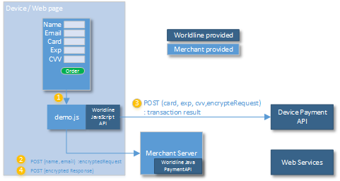

# Worldline Online Payments Acceptance - Java Payment API

[  ](https://bintray.com/worldlinenordics/payment-api/payment-api/_latestVersion)

The PaymentAPI can be used for different kinds of integration. More details about 
the integration is available on the developer portal, found via https://drwp.worldline.com/.

* Device Payment API
* Payment Page Integration 
 
## Getting started with Device Payment API



The Worldline JavaScript API will manage the interaction with the 
Device Payment API, taking the card number details from the form. 
It also requires information that is provided by the merchant, server side, 
and for that purpose the PaymentRequestBuilder is used like this: 

```java
PaymentHandler paymentHandler = new PaymentHandler(
        new JKSKeyHandlerV6("merchant.jks", "password", "signkey", "encryptkey"),
        "https://worldline-endpoint/");


PaymentRequest paymentRequest = new PaymentRequestBuilder()
        .setMid(1234567890L)
        .setOrderId("orderid")
        .setAmount(new BigDecimal(100.00))
        .setCurrency("USD")
        .setConsumerCountry("US")
        .setConsumerLanguage("en")
        .createPaymentRequest();

String deviceAPIRequest = paymentHandler.createDeviceAPIRequest(paymentRequest);

```

The response from the Device Payment API is then interpred by calling unpack:

```java
PaymentHandler paymentHandler = new PaymentHandler(
        new JKSKeyHandlerV6("merchant.jks", "password", "signkey", "encryptkey"));

PaymentResponse decodedResponse = handler.unpackResponse(response);

```
The decodedResponse then contains the transaction details needed for
determining the state of the transaction, like:
```java
System.out.println(decodedResponse.getStatus()); // Easy interpreted status OK / NOK / ERROR / PENDING
System.out.println(decodedResponse.getTransaction()); // Transaction Details.
System.out.println(decodedResponse.getTokenizationResult()); // For Tokenized cards
```


---

## Getting started with Payment Page integrations

The next kind of integration is using the Payment Page. This provides a convenient way 
of managing a payment integration, where Worldline Online Payments Acceptance manages
the payment form, interaction with the user on card details, and provides an easy
integration to 3DSecure and alternative payment methods. 


For creation of the redirect to Payment Page, follow this pattern:
```java
        PaymentPageHandler paymentPageHandler = 
            new PaymentPageHandler("URL", new JKSKeyHandlerV6("merchant.jks", "password", "merchant certificate", "drwp certificate"));


        PaymentPageRequest request = new PaymentPageRequest();
        request.setMid(1234567890L);
        request.setSubMerchantId("12");
        request.setPosId("ABC");
        request.setTransactionChannel("Web Online");
        request.setOrderId("orderid");
        request.setAmount(123.0);
        request.setCurrency("SEK");
        request.setConsumerCountry("SE");
        request.setConsumerLanguage("sv");
        request.setReturnUrl("http://merchant.com?f=3&f=q");
        request.setAuthorizationType(AuthorizationType.PRE_AUTHORIZATION);

        String redirectUrl = paymentPageHandler.createRedirectUrl(request);
```


## Dependencies

None


